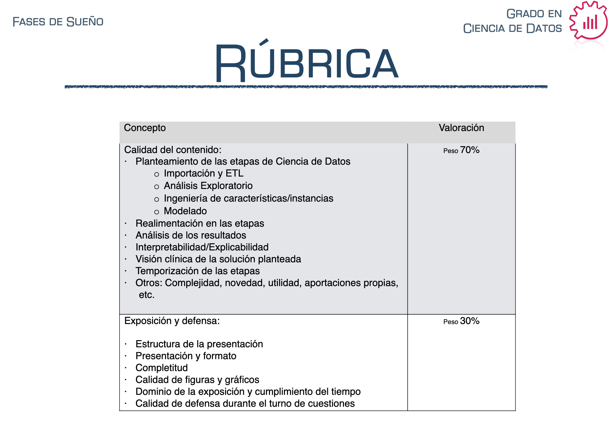

# Sleep Stage Detection Project

## Project Overview:
This project aims to detect sleep stages from polysomnographic data (EEG, EOG, ECG) of healthy patients. The goal is to develop a model that is useful for clinicians by automating the classification of sleep stages, thus reducing the need for manual annotation. The project leverages machine learning techniques, primarily using XGBoost.

## Data Source:
The data used in this project comes from the SleepTight dataset, specifically from Subgroup 3 (healthy patients). You can access the dataset [here](https://sleeptight.isr.uc.pt/?page_id=48).

## Requirements:
- **XGBoost** for model implementation.
- **Metrics:** AUC, F1 score (for each class) for both development (training and validation) and test sets (2 complete patients in all stages).
- **Variable Importance:** At least one method to assess variable importance.

## Deliverables:
1. **Slide Presentation** summarizing the results and methodology.
2. **Code** to justify the results obtained.
3. **Time Logs** detailing hours dedicated to each phase of the project.

## Evaluation Criteria:
- **Content:** 70% of the evaluation.
- **Presentation & Defense:** 30% of the evaluation.
- The evaluation mimics a bachelor’s thesis defense, with a focus on the process and usefulness for clinicians.

## Project Steps:
1. **Data Preprocessing:**  
   Segment the EEG, EOG, and ECG channels into 30-second windows and extract relevant clinical features (e.g., alpha/beta energy bands, spindles, artifacts, K-complexes).
   
2. **Model Implementation:**  
   - **Model Type:** XGBoost (multiclass or one model per class).
   - Apply appropriate techniques for **training, validation, and testing**.
   - **Adjustable Thresholds:** Explore ways to penalize simpler classes and favor complex ones.
   
3. **Interpretability:**  
   Ensure the model’s interpretability, with a focus on clinical relevance. Use interpretability libraries like **SHAP** or **LIME** for tree-based models.

## Key Questions:
- What training/validation/test strategy will you use?
- Does the model prioritize clinically relevant features?
- Have you considered the annotations from the doctors and how you handle discrepancies?

## Notes:
- The problem does not have a single solution, as even clinicians often disagree on the classification of sleep stages (see Kappa index on the dataset's results page).

